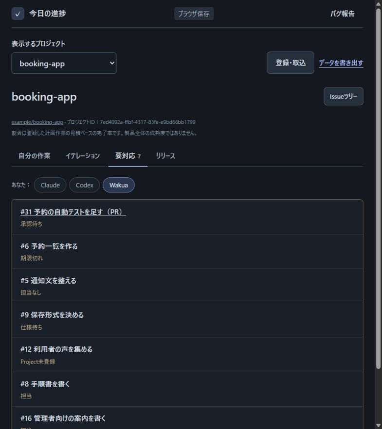
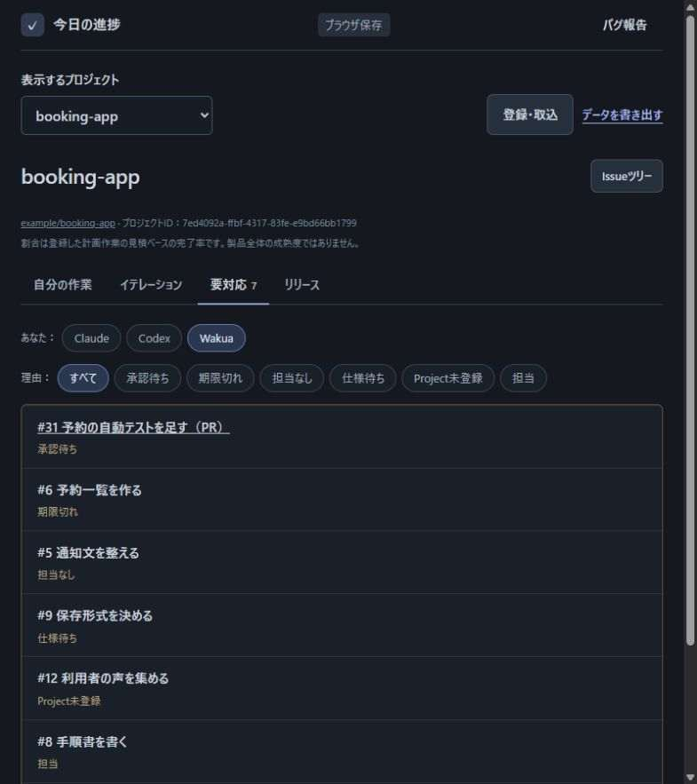
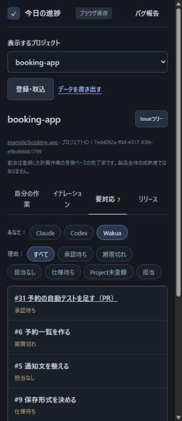
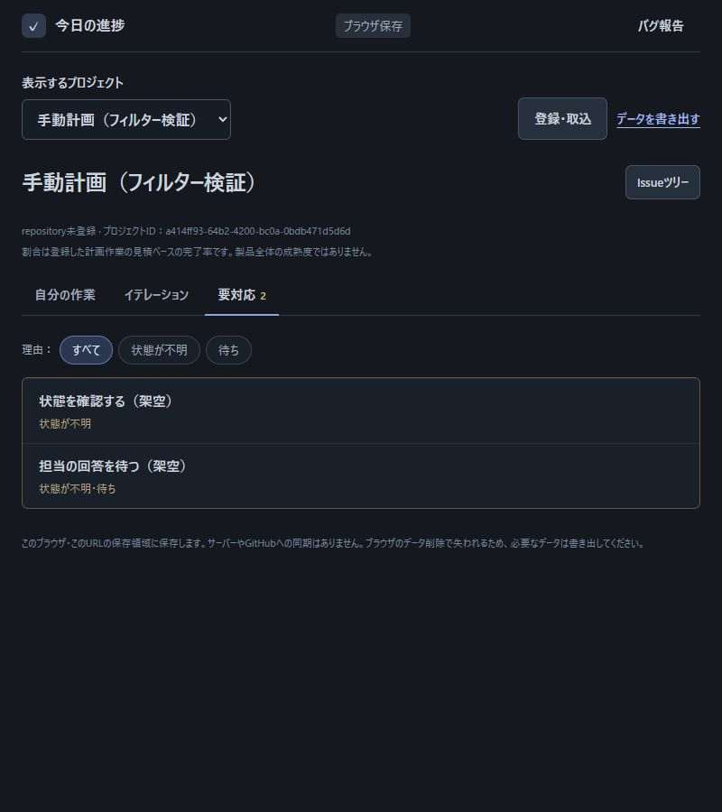
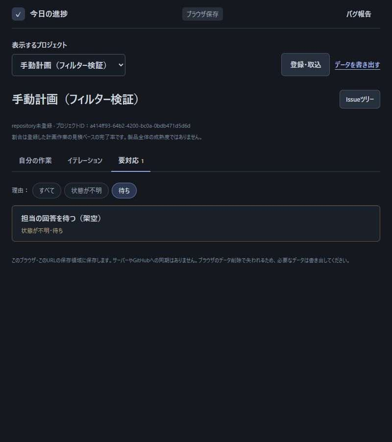

# 要対応の理由フィルターの確認

理由フィルターの操作前後を、架空データで確認した。
対象は [Issue #47](https://github.com/Wakua/github-progress-board/issues/47) であり、動作の規則は[要対応タブの仕様](specification.md#要対応タブ)に定める。

## 観察

2026-10-07に、本ツールのローカル画面をCodexが操作した。
変更前の出典はmainの `11938a9dafb6885b2bd88b40f9a0ee377169e367` である。
操作動画、外部ツールの操作デモ、実利用者の行動観察は行っていない。

予約管理アプリの架空データは `scripts/make-booking-sample.mjs` で生成し、GitHub snapshotの取込操作で読み込んだ。
実在するrepositoryのデータは使用していない。
既存操作の画像は `references/47/` に保存した。

| 操作 | 観察した事実 | 画像 |
| --- | --- | --- |
| 「自分の作業」で全員を表示し、Codexを選ぶ | 未完了の作業が14件から4件になり、Codexのボタンが選択状態になる | `references/47/owner-all.jpg`、`references/47/owner-codex.jpg` |
| 「要対応」を開き、「あなた」でWakuaを選ぶ | 元の5件を残し、担当作業2件を追加する | 下の変更前の画像 |

## 行動の整理

ユーザーは、このチャットで担当者による絞り込みよりも、理由による絞り込みを選んだ。
その回答と観察画面を根拠に、次の行動を整理した。
次の操作が有用だという判断は推測であり、実利用者の操作としては確認していない。

| 知りたいこと | 見る情報 | 判断 | 次の操作 |
| --- | --- | --- | --- |
| 期限切れの作業はどれか | 既存一覧の短い理由 | 期限切れへの対応に集中する | 同じ理由の行へ絞り込み、作業を開く |
| 承認するPRはどれか | 「承認待ち」の行 | 今確認するPRを選ぶ | 同じ理由の行へ絞り込み、PRを開く |
| 他の対応は何があるか | 選択状態と一覧 | 別の理由へ切り替えるか、全体に戻すか | 別の理由または「すべて」を選ぶ |

## 設計の根拠

既存の担当者フィルターは、選んだボタンと表示対象を対応させている。
理由フィルターもこの操作にそろえ、初めて使う操作を増やさない。

一覧の短い理由を選択肢にも使うことで、選択肢と結果を照合できる。
作業の行には既存の情報を保ち、操作説明の文章は常設しない。
詳細への移動は既存の作業名から行う。

## 操作結果

変更前後の比較画像は、同じ架空データ、同じ担当者選択、幅800ピクセルの画面で撮影した。
狭い画面の画像だけは幅390ピクセルである。

| 確認した操作 | 結果 | 画像 |
| --- | --- | --- |
| 「すべて」から「期限切れ」へ切り替える | #6だけを表示し、タブに1件と出る | 変更後の全件、期限切れ |
| 「承認待ち」へ切り替える | ReadyのPR #31だけを表示する | 承認待ち |
| 「担当」へ切り替え、その後「すべて」に戻す | 担当作業だけの表示から、元の並びへ戻る | 変更後の全件 |
| 「担当」の選択中にWakuaを解除し、再び選ぶ | 理由が無くなると「すべて」になり、再選択しても全件の表示を保つ | 画面操作で確認 |
| 幅390ピクセルで表示する | ボタンが折り返され、横のはみ出しがない | 狭い画面 |
| 絞り込んだ作業を開いて閉じる | 既存の読み取り専用詳細へ移動できる | 画面操作で確認 |
| 手動計画で「待ち」を選ぶ | 「状態が不明・待ち」の作業だけを表示する | 手動計画の全件、待ち |
| キーボードのEnterで「状態が不明」を選ぶ | 該当する作業を表示し、選択ボタンにフォーカスが残る | 画面操作で確認 |
| GitHubの計画と手動計画を往復する | それぞれの理由の選択を保つ | 画面操作で確認 |
| ページを再読み込みする | 「すべて」の表示に戻る | 画面操作で確認 |

## 検証

- `npm test`：370件成功。
- `npm run check`：成功。
- 画像の追加後に `node scripts/check-screenshots.mjs` を実行し、保存規則への適合を確認した。

MCP出力契約の既存テストには、同梱Pythonと既存の検証用jsonschemaを使用した。
アプリの依存関係は追加していない。
関連文書として、要対応タブの仕様、操作の説明、③④の行動の整理、画像の規則を読み、今回の動作の定義先を仕様へまとめた。

## ユーザー確認

2026-10-07に、ユーザーがこのチャットで試作に「OK」と回答し、表示と操作の方針を承認した。

## 未確認

- 実利用者が、理由を選んで対応する作業を見つけられるか。
- 外部ツールの操作動画・操作デモとの比較。
- 本番クラウド環境での操作。

## 履歴

- 2026-10-07: 理由フィルターの観察、設計の根拠、操作結果を記録した。
