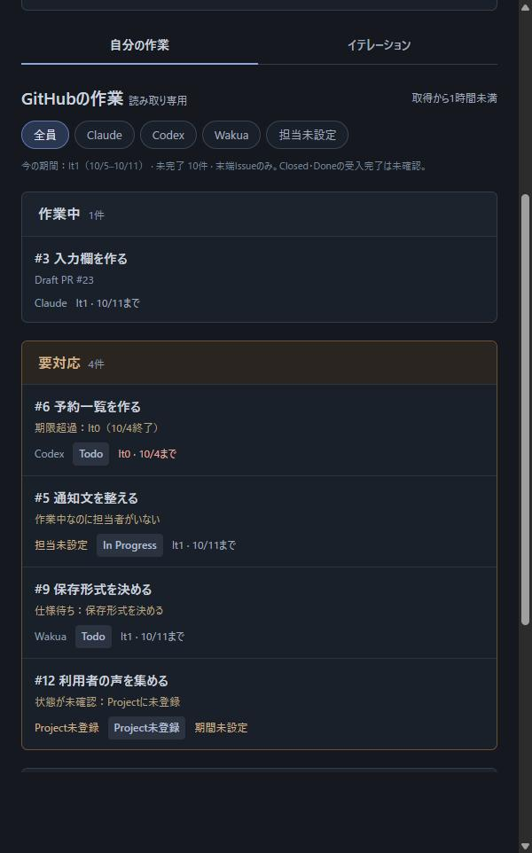
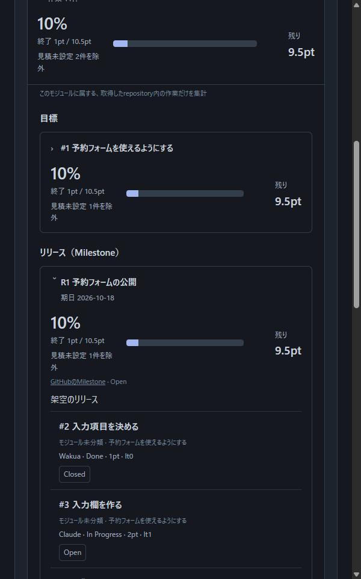

# ③④の行動の整理（2026-10-05）

Issue #3 の記録。③ 要対応と ④ リリースの画面を設計する前に、人が何を知りたくて、何を判断し、次に何を操作するかを整理する。

根拠は次の3件である。行動はAIが資料から組み立てた推測であり、実利用者の行動は観察していない。

- Issue #2 の観察：GitHub の Milestone と依存関係（Blocked）の実画面、Linear の公式文書。
- [進捗管理の仕様](specification.md)の「自分の作業と要対応」「GitHubから表示する計画」。
- 2026-10-04 のユーザー決定：リリースは GitHub の Milestone に対応させ、間に合うかは自動で判定せず、計画のはみ出しを示す（Issue #1）。

## 現状の画面（変更前）

③④の設計の出発点として、今の画面を残す。架空の予約管理アプリ（GitHub で計画しているプロジェクト）のデータで撮った。データは `node scripts/make-booking-sample.mjs` で作れる。画像は Milestone が1件の時点のデータで撮った。現在の試作データには Milestone が2件（R1・R2）あり、どちらにも期日より後の割当を含む（Issue #4）。実在のrepositoryのデータは使っていない。画面の幅は600ピクセルで、撮影日は2026-10-05である。

**① 自分の作業**：要対応が、当たった条件を理由にして並ぶ。③ はこの表示を土台にする。

- 要対応4件の理由が出ている：期限超過（#6）、作業中なのに担当者がいない（#5）、仕様待ち（#9）、Projectに未登録（#12）。
- 「何をすれば解除できるか」は出ていない。理由の文言だけである。

**② イテレーション**：リリース（Milestone）は、名称、期日、終了率、残りのEstimate、割り当てた作業の一覧が出る。

- 期日（2026-10-18）、終了率10%、残り9.5pt、「見積未設定 1件を除外」は出ている。
- 各作業の行には、担当・Status・Estimate・イテレーション名が文字で並ぶ。#7 は「Estimate未設定・期間未設定」と文字で出る。
- 次は出ていない：期日までの残りイテレーション数、期日より後の割当への印（#8 は It3 で期日より後だが、イテレーション名の文字だけ）、期限超過への印（#6 は It0 が終了済み）、要対応の件数、③ へ移る操作。④ はここを足す。

撮影していない操作：詳細パネルの表示、幅の狭い画面、③④のタブ（まだない）。

## 採用済みの前提

- リリースは Milestone とする。Milestone は2イテレーション（2週間）ごとに区切り、期日までにその作業のPRをマージする。期日後にユーザーが main を確認する（[AGENTS.md](../AGENTS.md)）。
- 要対応の条件と、前提待ちを要対応に含めない規則は [自分の作業と要対応](specification.md#自分の作業と要対応) に従う。
- 操作する場所を分ける。手動計画はツール内で編集する。GitHub の計画は読み取り専用で、ツールは GitHub へ書き込まない。変更は GitHub 上で行い、ツールの再取得で反映する（[ローカルghの自動取得](github-integration.md#ローカルのghで自動取得する)）。
- ④ は、完了予定日と見通しの良し悪し（On track など）を出さない。クリティカルパス（Estimate で重み付けした最長の前提の流れ）は完了予定日なしで示す（Issue #6）。

**2026-10-05 ユーザー決定**

- ④ には期限超過の件数だけを出し、作業名と理由は ③ に置く。
- クリティカルパスは、Estimate が未入力の作業を足さず、未入力の件数を添える。
- ④ は GitHub で計画しているプロジェクトだけに出す。手動計画のプロジェクトには出さず、Milestone を持たせない。
- ③ は、期限切れの古い作業を上に並べる。期限超過に当たらない要対応は、その後ろに登録順で並べる（暫定）。

## ③ 要対応：どこで人の手が要るか

| 段階 | 見る情報 | 判断 | 次の操作 | 根拠 |
| --- | --- | --- | --- | --- |
| 見つける | 要対応の作業の一覧と件数 | どれから手を付けるか | 作業を開く | GitHub は止まっている Issue の一覧に「Blocked」の印を出す |
| 理由を読む | 当たった条件と、解除に必要な対応 | 自分が対応するか、他の人・AIに任せるか | 手動計画：判断の記録・状態・割当・担当をツール内で変える。GitHub の計画：GitHub 上で変更し、再取得する | GitHub は Issue の上部に前提のタイトルを出す。Linear は「Blocked by」を作業の横に出す |
| 前提をたどる | 前提のタイトルとリポジトリ | 前提を先に進めるか | 前提を開く（別のリポジトリはGitHubで開く） | GitHub は別のリポジトリの前提も同じ形で出す |

**一覧に出すもの**：作業名、担当者、当たった条件（すべて）、解除に必要な対応の1行。
**詳細へ移すもの**：完了条件、成果の根拠、前提と後続、Estimate。
**含めないもの**：前提待ち（計画どおりの順番待ち）。

**解除に必要な対応（提案）**：条件ごとに、人が次にすることを1行で示す。手動計画はツール内で操作する。GitHub の計画は GitHub 上で操作し、再取得で反映する。いずれも、当たった条件を解消する操作に限る。条件が残る限り、要対応のままである。

| 当たった条件 | 手動計画（ツール内） | GitHub の計画（GitHub 上） |
| --- | --- | --- |
| 未解決の判断待ち | 判断を記録する | 該当なし |
| 待ちの理由がある | 待ちを解除する | 該当なし |
| 状態が未確認 | 状態を更新する | Project に登録する、Status を設定する・揃える |
| 仕様待ち | 該当なし | 仕様を決める |
| 作業自身のイテレーションが終了 | 割当を変えるか完了にする | Iteration を変えるか閉じる |
| 未完了の前提のイテレーションが終了 | 前提を進める | 前提を進める |
| 作業中なのに担当者がいない | 担当を決める | 担当を決める |
| 作業中なのに未完了の前提がある | 未着手に戻すか前提を完了する | Todo に戻すか前提を閉じる |

## ④ リリース：リリースに間に合うか

| 段階 | 見る情報 | 判断 | 次の操作 | 根拠 |
| --- | --- | --- | --- | --- |
| 期日を見る | Milestone の名称、期日、残りイテレーション数、残りの Estimate | 残りが期間に収まりそうか（人が読む） | はみ出しを開く | GitHub の Milestone は名称・期日・件数の完了率を出し、間に合うかは出さない |
| はみ出しを見る | 期日より後のイテレーションに割り当てた作業、未割当、Estimate 未入力、期限超過の件数 | 割当を変えるか、範囲を減らすか | 作業を開き、GitHub 上で Project の Iteration を変える。ツールは読み取り専用で、再取得で反映する | 2026-10-04 のユーザー決定（計画のはみ出しを示す） |
| 長い流れを見る | クリティカルパス（最長の前提の流れ）。Estimate 未入力の作業は足さず、件数を添える | どの作業が遅れると全体が遅れるか | 流れの作業を開く | 推測：Linear は予測日を出すが、本ツールは出さない |
| 人の手を見る | 要対応の件数 | ③ で対応するか | ③ へ移る | ③ と ④ の重なり（下記） |

**出さないもの**：完了予定日、予測の幅、見通しの良し悪し。Linear は健全性（On track・At risk・Off track）を担当者が選ぶ。本ツールは判定しない。

## ③ と ④ の重なり：置き場所

| 情報 | ③ | ④ | 置き場所 |
| --- | --- | --- | --- |
| 要対応の作業名と理由 | 出す | 件数だけを出し、③ へ移る | ③ |
| 期限超過（作業自身・前提のイテレーションが終了） | 理由として出す | はみ出しの件数 | 作業名と理由は ③、④ は件数 |
| 期日より後の割当・未割当 | 出さない（期間の終了前は計画どおり） | 出す | ④ |
| Estimate 未入力 | 出さない（要対応の条件ではない） | 出す | ④ |
| 前提待ち | 含めない | クリティカルパスの流れに現れる | ④ |

## 画面の切り替え

- ③ は選んだプロジェクトの中、④ は Milestone ごとに表示する。タブは ①自分の作業、②イテレーション、③要対応、④リリースにする。
- ④ は GitHub の Milestone を使うため、GitHub で計画しているプロジェクトだけに出す。

## 未決定事項

- 期限超過に当たらない要対応の並びは、登録順を暫定とする。試作（#5）で、並びが分かりにくくないかを確かめる。

## 未確認

- 実利用者がどの順で ③④ を見るか。
- GitHub にログインした状態の Project のロードマップ表示、Linear の実画面。
- 試作（#5、#6）での表示と操作。
